# Quicktake 100 Guide

How to get photos off of your Quicktake 100. A guide for Mac users. 

## Table of Contents

- [Introduction](#introduction)
- [Step 1 - Purchase your materials](#step-1---purchase-your-materials)
- [Step 2 - Configure Windows XP for VirtualBox](#step-2---configure-windows-xp-for-virtualbox)
- [Step 3 - Install Windows XP](#step-3---install-windows-xp)
- [Step 4 - Install QuickTake software and serial drivers](#step-4---install-quicktake-software-and-serial-drivers)
- [Step 5 - Connect your Camera](#step-5---conect-your-camera)
- [Useful Links](#useful-links)
- [References](#references)

## Introduction

This guide is comprised of different tips I've picked up over the past several, infuriating weeks trying to get photos off of my QuickTake 100. I could not find a comprehensive, start to finish guide that explains all the steps in detail, so that is what I'm going to attempt to do in this repository here. 

For simplicity's sake, I've included all the relevant QuickTake software you'll need along with the driver's you'll need in order to configure the software to work within VirtualBox. 

Big shoutout to Dustin who provided me with info about a serial-USB adapter that actually worked with this camera (I had gone through 2 of these with no success). Without his help I likely would have gone through 2 or 3 more of these. 

## Step 1 - Purchase your materials

These cables are guaranteed to work, and you should be able to purchase them directly assuming these links are still active. For posterity, I've also included screenshots from Amazon/eBay where appropriate. 

### 1. Male DB9 serial to Male USB adapter

There are many cables out there, but this is the only one that worked for me. [Here's a link to purchase the adapter on Amazon](https://www.amazon.com/gp/product/B004ES1S14/)

### 2. Male 8 Pin Mini-DIN to Female DB9 serial adapter

This one is generally more difficult to track down, but [I was able to find this one on eBay](https://www.ebay.com/itm/184203852259) that was counterinutively cheaper than the DB9 to USB adapter. Some other folks were suggesting that I should build my own or acquire an OEM Apple Newton adapter, however that was not necessary in my case. [You can also find this on this seller's own store pccables.com](https://pccables.com/cgi-bin/orders6.cgi?action=Search&search=db9+female+to+8-pin+mini+din)

## Step 2 - Configure Windows XP for VirtualBox

I used VirtualBox for this tutorial because it's free and relatively easy to use. I did also have success with VMWare Fusion, but I don't believe there's much additional value I got out of using that software. 

### 1. Acquire a 32 Bit Windows XP License & .iso Image

Conveniently, this is relatively easy to find. [Follow this link on archive.org to download a copy](https://archive.org/details/WinXPProSP3x86), there should also be a serial key on this page. Take note of this as you will need it later. 

### 2. Download VirtualBox

This should be self-explanatory. For clarity, I'm using VirtualBox version 6.1. [You can find the download link here](https://www.virtualbox.org/wiki/Downloads)

### 3. Configure a Windows XP VM in VirtualBox

Using the .iso image you downloaded earlier, create a VM in Virtualbox. This is a relatively simple process, but I've broken it down to make it more clear what settings were used.

#### a. Click "New" to create a new VM

#### b. Give the VM a name and select the operating system. Continue past the defaults.

After you do this, you can basically just click through and use the default options for the virtual disk and all the other settings.

#### c. Configure the .iso image as a virtual optical disk 

> **_NOTE:_** In order to complete this step appropriately, you will need to configure VirtualBox Guest Additions. [See this Stack Overflow article for more information](https://stackoverflow.com/questions/41691803/how-to-install-guest-addition-in-mac-os-as-guest-and-windows-machine-as-host).

Select your VM, click on the "Settings" gear icon, and then navigate to the "Storage" tab in the popup window. Click on the little disk icon and then select "Choose a disk file." From this dialog, select the Windows XP .iso image. 

#### d. Plug in your serial to USB adapter and add it to the USB Device Filters list

While still in the "Settings" menu for the VM, select the "Ports" tab and additionally select the "USB" option. Once you plugin the adapter and click the add button, you should see a device with something like `FTDI FT232R USB UART`. This is your USB adapter. 

## Step 3 - Install Windows XP

Now that you've configured your VirtualBox VM, you'll want to configure Windows XP and install all the correct software. 

### 1. Follow boot screen prompts

Select your new VM, then click the "Start" button. You should see a new Window pop up. You should immediately boot into the Windows XP setup. Follow the prompts and configure the default options. 

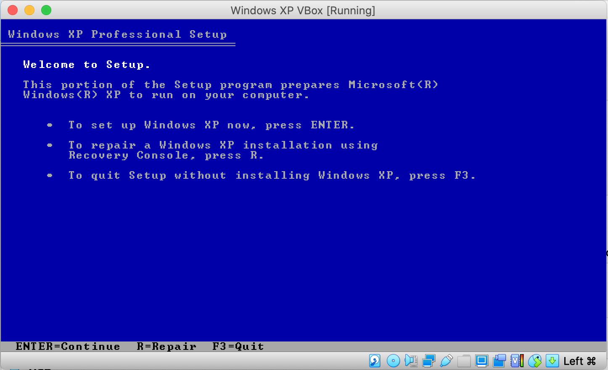

### 2. Configure your Windows XP license key

After the machine restarts, you will be prompted to register your name and enter your license key. Use the one included in the [archive.org link shared earlier](https://archive.org/details/WinXPProSP3x86).

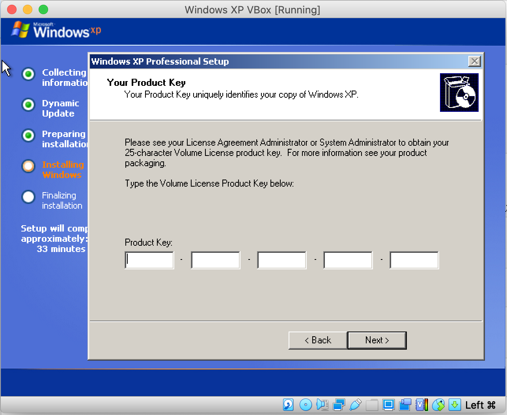

### 3. Complete Windows XP installation

Click through the on-screen prompts and configure an Administrator password. Once everything's done, you should have a working Windows XP box. The machine will restart and you'll do some additional form filling etc. You may want to detach the virtual CD ROM you set up in Step 2 as it is no longer needed. 

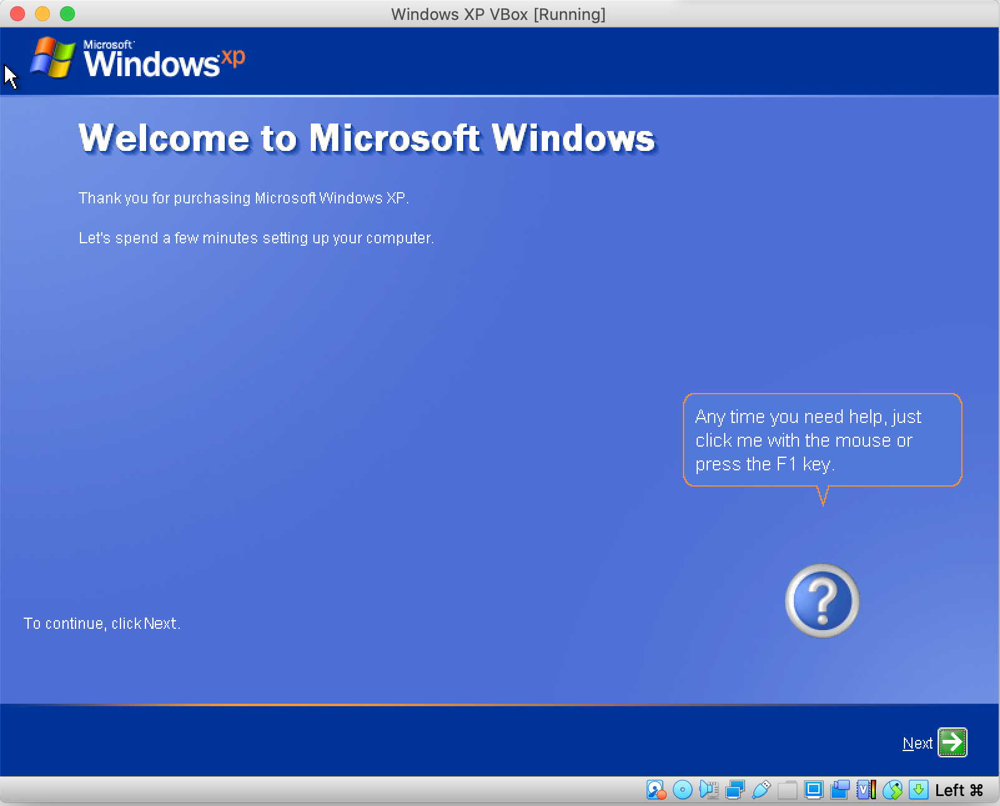

## Step 4 - Install QuickTake software and serial drivers

Now that you have Windows XP set up, it's time to install all the correct software. 

### 1. Download the QuickTake software

Enable drag and drop on the Windows XP VM by selecting `Devices > Drag and Drop > Bidirectional`. After this simply download the [QuickTake software included in this repo](software/QuickTakeSoftware.zip) and drag it over to the Desktop in your Windows XP VM. 

Remember, this will only work if VirtualBox Guest Additions is already installed. All you have to do to install this is mount the Guest Additions .iso and complete the installation steps. 

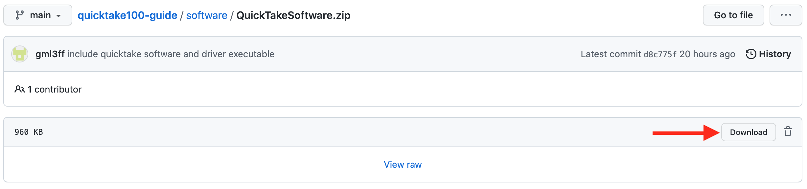

### 2. Extract the file and run the setup script for QuickTake

Double click on the zipped file, click "Extract all files". Double-click on the "Setup" executable in the newly extracted folder, you should be presented with this glorious 90s setup wizard.

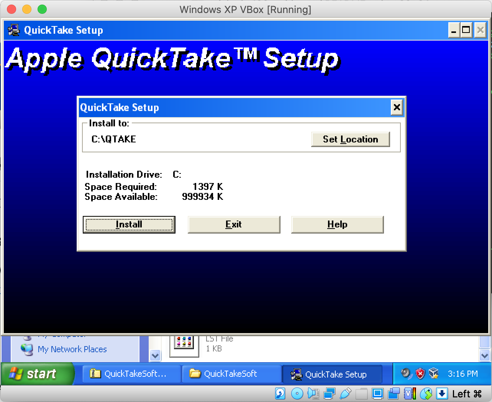

Once the instlall is completed you should see your QuickTake software in the program list. 

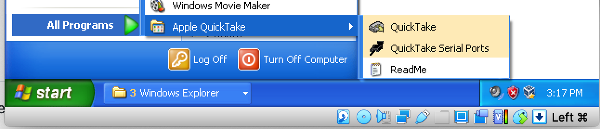

### 3. Download the drivers for the serial adapter

There's an executable [for these in this repo](software/Adapter_Drivers_Setup.exe). But if you'd rather download directly from the manufacturer [you can find that here](https://www.ftdichip.com/old2020/Drivers/VCP.htm). Drag and drop to the Desktop just like you did before. 

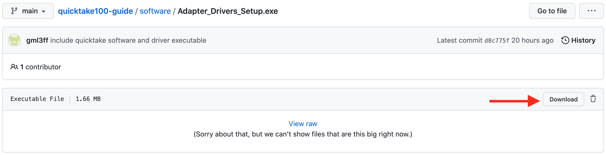

### 4. Install the driver executable

Double click on the driver setup, you should see it complete almost immediately. 

## Step 5 - Connect your Camera 

### 1. Attach the cable to your camera and corresponding adapter

Push in the slider on the side of the camera which should expose the 8-pin DIN connector. 

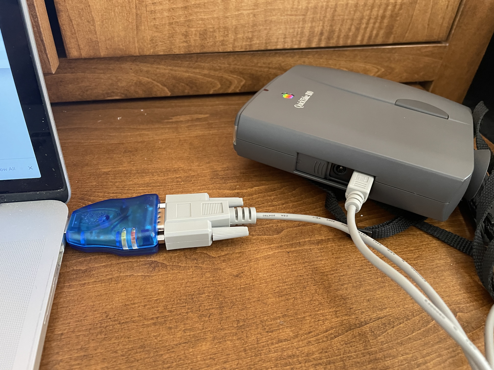

### 2. Open the "QuickTake Serial Ports" software

You'll use this to test the camera's connectivity. Set the "Baud Rate" to "9600". 

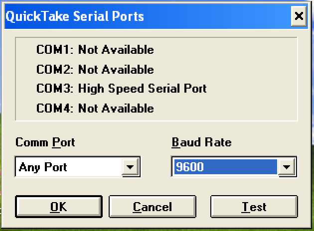

### 3. Power on your camera 

Open the slider near the front of the lens to turn the camera on. You should see a spinning rectangle on the display which indicates the camera is ready to sync to the computer. 

Be aware that serial connectivity uses a lot of battery. Use the DC jack or make sure you have rechargeable AA batteries with a decent amount of charge.

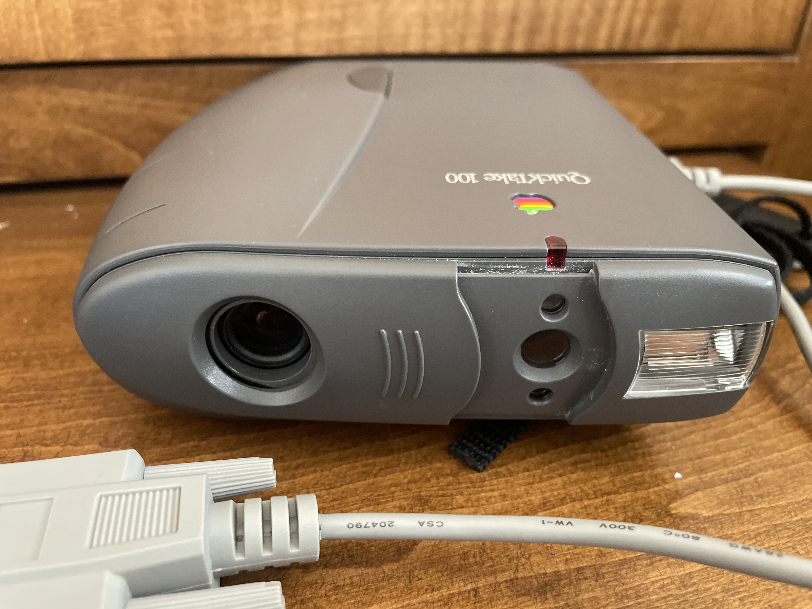

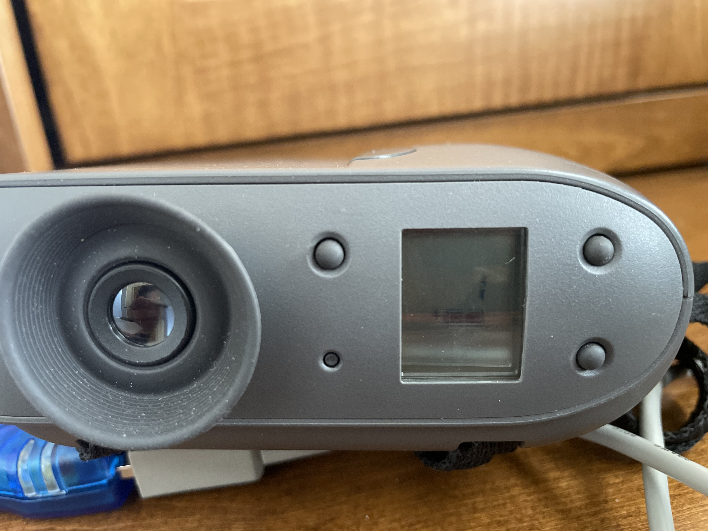

### 4. Test the camera's connectivity

Select the COM port that says "High Speed Serial Port" (this was COM3 in my case). Then click "Test". If connectivity is successful you should see this pop-up dialog. 

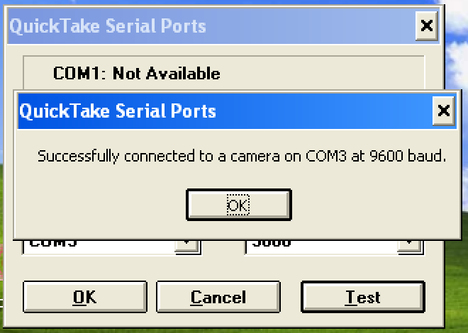

### 5. Open the QuickTake software and connect

Select `Camera > View All Slides in Camera`. You should see all the images as thumbnails that you can download. 

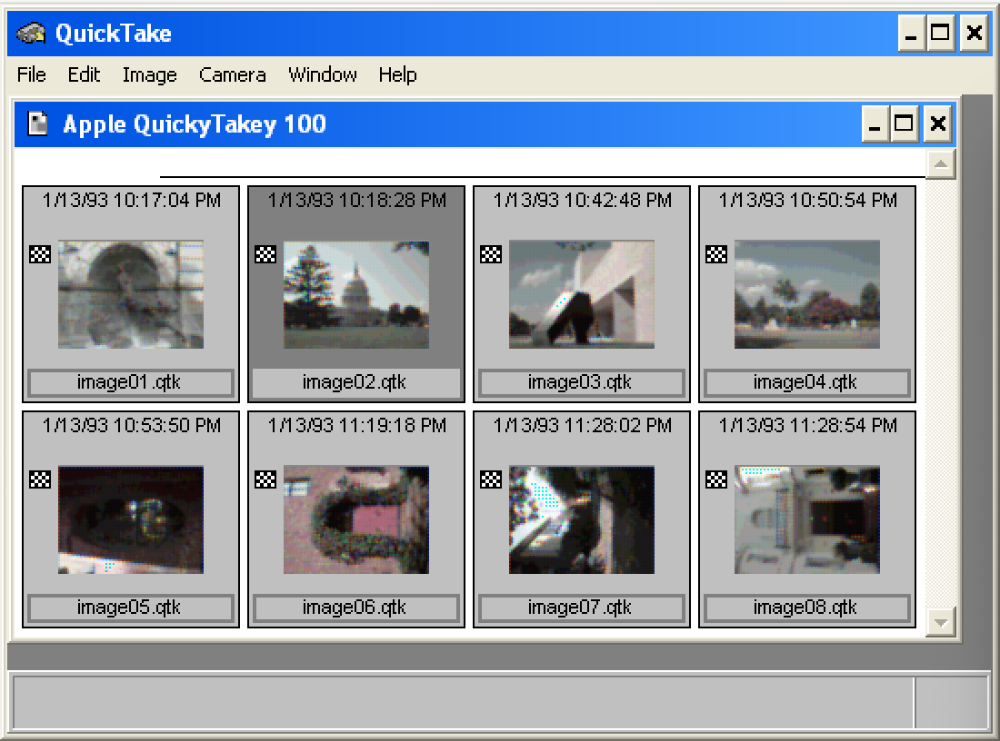

### 6. Download an image. 

Select an image of your choice then click `File > Save As`. I typically recommend exporting as .tif as this is a high quality format compatible with most image editing software. 

You can also download all of these using `Camera > Move All Camera Images to Disk`, but I'd recommend just selecting them manually and clicking `Save As` as it allows you to choose a "normal" image format more easily. 

Downloading is extremely slow, so this is another reason not to do this all at once. 

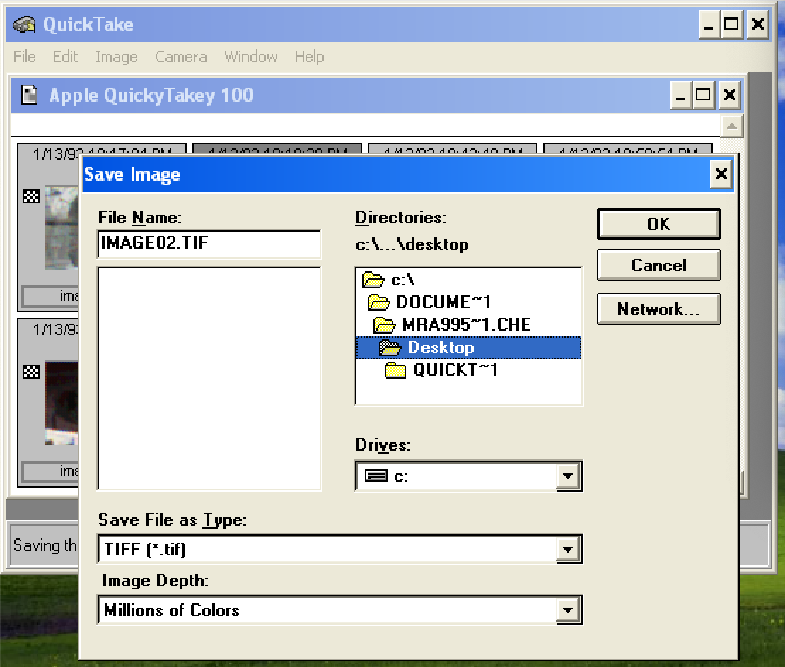

### 7. Copy the image back to your host computer

Drag and drop the image that you've downloaded to the Windows XP VM to a folder of your choice. Congratulations you've successfully gotten images off of your QuickTake 100!!

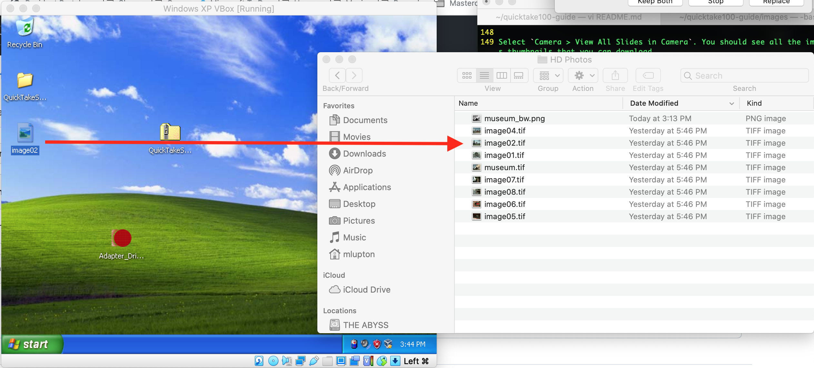

Gotta say I was pleasantly surprised by the "High Resolution" mode. Definitely not a lot of pixels, but produces a half-decent image. 

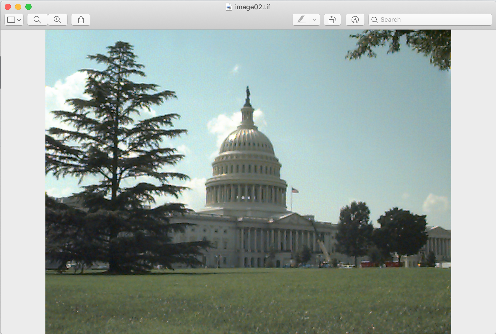

## Useful Links 

Some other links that may be helpful to you. 

- [QuickTake 100 User Guide](https://archive.org/details/manuallib-id-2626234/mode/2up)

## References

Below are a few pages that were of immense use to me while figuring this out. 

- [A QuickTake 100 in the MacOS era (2018) - Dustin.lol](https://dustin.lol/post/2018/quicktake100/)
- [Using Apple QuickTake 100 in OS X era (2012) - Pinot W. Ichwandardi](http://pinotmac.blogspot.com/2012/03/using-apple-quicktake-100-in-os-x-era.html)
