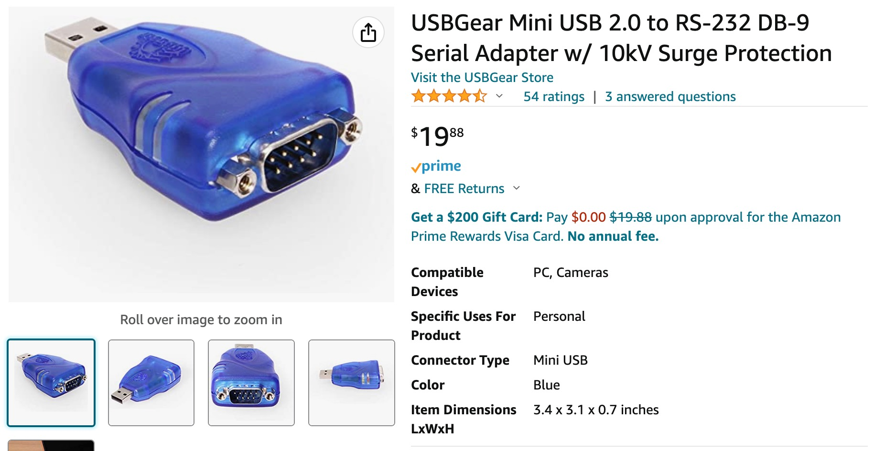
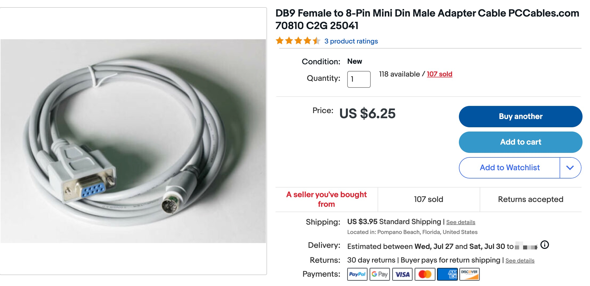
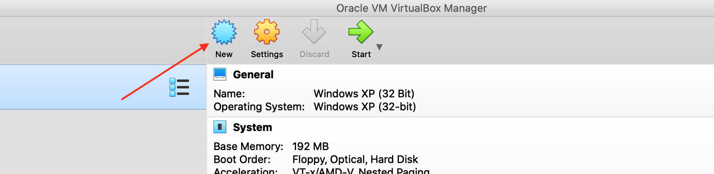
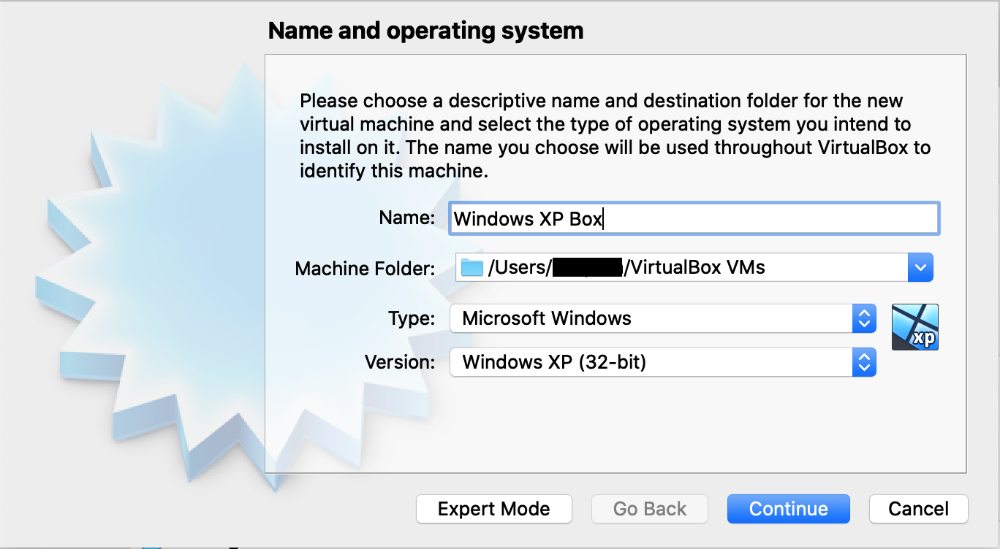
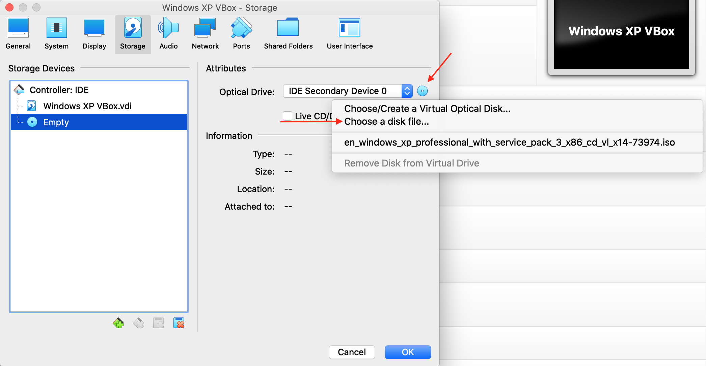
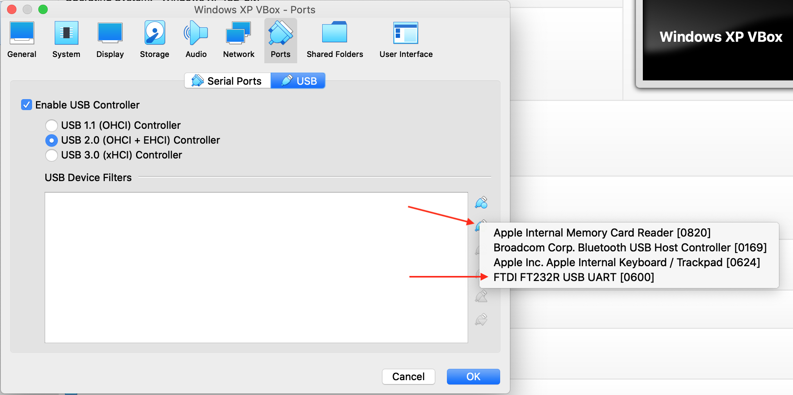

# Quicktake 100 Guide

How to get photos off of your Quicktake 100. A guide for Mac users. 

## Introduction

This guide is comprised of different tips I've picked up over the past several, infuriating weeks trying to get photos off of my QuickTake 100. I could not find a comprehensive, start to finish guide that explains all the steps in detail, so that is what I'm going to attempt to do in this repository here. 

For simplicity's sake, I've included all the relevant QuickTake software you'll need along with the driver's you'll need in order to configure the software to work within VirtualBox. 

Big shoutout to Dustin who provided me with info about a serial-USB adapter that actually worked with this camera (I had gone through 2 of these with no success). Without his help I likely would have gone through 2 or 3 more of these. 

## Step 1 - Purchase your materials

These cables are guaranteed to work, and you should be able to purchase them directly assuming these links are still active. For posterity, I've also included screenshots from Amazon/eBay where appropriate. 

### 1. Male DB9 serial to Male USB adapter

There are many cables out there, but this is the only one that worked for me. [Here's a link to purchase the adapter on Amazon](https://www.amazon.com/gp/product/B004ES1S14/)

### 2. Male 8 Pin Mini-DIN to Female DB9 serial adapter

This one is generally more difficult to track down, but [I was able to find this one on eBay](https://www.ebay.com/itm/184203852259) that was counterinutively cheaper than the DB9 to USB adapter. Some other folks were suggesting that I should build my own or acquire an OEM Apple Newton adapter, however that was not necessary in my case. [You can also find this on this seller's own store pccables.com](https://pccables.com/cgi-bin/orders6.cgi?action=Search&search=db9+female+to+8-pin+mini+din)

## Step 2 - Configure Windows XP for VirtualBox

I used VirtualBox for this tutorial because it's free and relatively easy to use. I did also have success with VMWare Fusion, but I don't believe there's much additional value I got out of using that software. 

### 1. Acquire a 32 Bit Windows XP License & .iso Image

Conveniently, this is relatively easy to find. [Follow this link on archive.org to download a copy](https://archive.org/details/WinXPProSP3x86), there should also be a serial key on this page. Take note of this as you will need it later. 

### 2. Download VirtualBox

This should be self-explanatory. For clarity, I'm using VirtualBox version 6.1. [You can find the download link here](https://www.virtualbox.org/wiki/Downloads)

### 3. Configure a Windows XP VM in VirtualBox

Using the .iso image you downloaded earlier, create a VM in Virtualbox. This is a relatively simple process, but I've broken it down to make it more clear what settings were used.

#### a. Click "New" to create a new VM

#### b. Give the VM a name and select the operating system. Continue past the defaults.

After you do this, you can basically just click through and use the default options for the virtual disk and all the other settings.

#### c. Configure the .iso image as a virtual optical disk 

> **_NOTE:_** In order to complete this step appropriately, you will need to configure VirtualBox Guest Additions. [See this Stack Overflow article for more information](https://stackoverflow.com/questions/41691803/how-to-install-guest-addition-in-mac-os-as-guest-and-windows-machine-as-host).

Select your VM, click on the "Settings" gear icon, and then navigate to the "Storage" tab in the popup window. Click on the little disk icon and then select "Choose a disk file." From this dialog, select the Windows XP .iso image. 

#### d. Plug in your serial to USB adapter and add it to the USB Device Filters list

While still in the "Settings" menu for the VM, select the "Ports" tab and additionally select the "USB" option. Once you plugin the adapter and click the add button, you should see a device with something like `FTDI FT232R USB UART`. This is your USB adapter. 

## Step 3 - Install Windows XP and Required Software

Now that you've configured your VirtualBox VM, you'll want to configure Windows XP and install all the correct software. 

#### a. Select your new VM, then click the "Start" button. You should see a new Window pop up. You should immediately boot into the Windows XP setup. Follow the prompts and configure the default options. 

#### b. Once the install is completed setup your Administrator user and continue.

 

## References

Below are a few pages that were of immense use to me while figuring this out. 

- [A QuickTake 100 in the MacOS era (2018) - Dustin.lol](https://dustin.lol/post/2018/quicktake100/)
- [Using Apple QuickTake 100 in OS X era (2012) - Pinot W. Ichwandardi](http://pinotmac.blogspot.com/2012/03/using-apple-quicktake-100-in-os-x-era.html)
